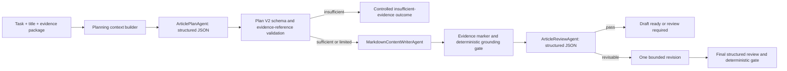

# Deep Worker Protocol V2 Refactor Plan

> **For agentic workers:** REQUIRED SUB-SKILL: Use `superpowers:subagent-driven-development` (recommended) or `superpowers:executing-plans` to implement this plan task-by-task. Steps use checkbox (`- [ ]`) syntax for tracking.

**Status:** PM reviewed proposal, implementation not started. Current V2.3.1 release remains `NO-GO`; same-version paid retries are closed.

**Goal:** Make Deep generation reliably distinguish protocol errors, controlled evidence insufficiency, grounded draft delivery, and article-quality failures before any further paid comparison is allowed.

**Architecture:** Separate plan, review, and Markdown-writing agents; use provider-supported structured output for JSON stages; replace the ambiguous V2.3.1 plan contract with a smaller V2 schema; preserve deterministic evidence and publication gates. Qualify the protocol entirely offline first, then run one bounded paid protocol canary, and only after that evaluate Prompt/Skill quality as a separate variable.

**Tech Stack:** Laravel 12, PHP 8.x, Laravel AI, DeepSeek/OpenAI-compatible providers, PostgreSQL, Redis queue, Blade/Tailwind, PHPUnit, Docker.

## Global Constraints

- Do not apply candidate Prompt presets to the business database during protocol work.
- Do not publish, distribute, deploy, switch Docker source mounts, or overwrite existing articles.
- Do not change Standard generation behavior while refactoring Deep generation.
- Do not weaken evidence ID validation, privacy rules, unsafe-guidance rules, revision-bound approval, or publication guards.
- Do not silently fall back from the new Deep protocol to the old protocol in the same task.
- Do not make paid model calls in Phases 0-5.
- Any paid call in Phase 6 requires a separate explicit user approval and a frozen run manifest.
- A failed paid protocol version cannot be retried with the same protocol version; fix it, bump the version, and repeat offline qualification first.
- Existing V2.3.1 Prompt/Skill text remains frozen until protocol qualification is complete, so protocol and content changes are not mixed.
- Full evidence, raw prompts, model output, customer information, and API credentials must not enter tracked fixtures, logs, exception messages, or persisted generation trace.

---

## 1. PM Executive Review

### 1.1 Business problem

The current result says only `NO-GO`, but that label currently mixes three different product outcomes:

1. **Protocol failure:** the model returned data that the Worker could not parse or validate.
2. **Evidence boundary outcome:** the system correctly determined that source material was insufficient and should not generate an article.
3. **Content-quality failure:** a real article was generated, but it was unsupported, unsafe, too templated, or otherwise not good enough.

Because the final paid V2.3.1 gate stopped during plan validation, it produced no article body. It therefore proves that the current planning protocol is unreliable; it does **not** prove whether the latest Skill improves or harms article quality.

### 1.2 Root-cause allocation

PM working diagnosis for the latest failure loop:

| Area | Estimated responsibility | Why |
|---|---:|---|
| Worker / Deep protocol | 70% | One Markdown writer agent is used for JSON plan/review and Markdown draft; the plan schema duplicates unknown-state concepts; validator heuristics reject semantically acceptable plans; repair receives only one loose error string. |
| Master/Skill stage leakage | 20% | Full article-writing requirements are injected into the planning stage, so the planner receives instructions such as writing a shorter article or returning questions even though it must emit a strict JSON plan. |
| Model variance | 10% | Structured output can still vary, but current deterministic contract issues are sufficient to explain the repeated failures without blaming the model first. |

These percentages are prioritization estimates, not statistical measurements.

### 1.3 PM verdict

**Recommended:** execute Phases 0-5 of this protocol refactor. Hold Phase 6 paid calls until all offline gates pass. Hold all Skill quality conclusions until Phase 7.

**Rejected as the next move:** another Prompt-only patch to `article_angle` or `open_question` followed by another paid retry. It is fast, but it leaves the conflicting agent role, duplicated schema concepts, weak repair feedback, and non-auditable failure path intact.

### 1.4 Approaches considered

| Approach | Benefit | Cost / risk | PM conclusion |
|---|---|---|---|
| A. Patch two validator rules only | Smallest change | Likely moves failure to the next brittle field; cannot isolate protocol from Skill quality | Reject |
| B. Structured stage agents + Plan V2 | Fixes the responsibility boundary and makes offline qualification possible | Moderate focused refactor | **Recommend** |
| C. Remove Deep planning/review and keep single-turn generation | Simplest runtime | Loses the evidence-sufficiency and revision workflow already built | Reject for now |

---

## 2. Current-Code Findings

1. `app/Ai/Agents/MarkdownContentWriterAgent.php` defaults to a Chinese Markdown writer role, but the same agent is also used for English JSON planning and review.
2. `app/Services/GeoFlow/ArticleModelCallService.php` always instantiates `MarkdownContentWriterAgent`; it receives only a boolean for article completeness and has no typed stage contract.
3. Laravel AI already exposes `HasStructuredOutput`, and the installed DeepSeek gateway sends `response_format: {type: json_object}` when a schema is supplied. The current Deep stages do not use it.
4. `app/Services/GeoFlow/DeepArticleGenerationService.php` injects the complete Master + Skill + Style writing brief into the plan stage.
5. The current plan contains both section-level `support_type=open_question` and top-level `open_questions`; both represent the same unknown state.
6. `central_answer` and `article_angle` are free-form fields but are rejected by broad specific-claim regexes. The error says the fact is "unmapped" even though that validator does not inspect `evidence_mapping` for those fields.
7. Plan validation throws on the first issue. The model repair receives one natural-language error without a stable code, JSON path, expected value, or complete violation list.
8. If the repaired plan fails validation, `deep_plan_repair` stage metadata and its provider usage are not reliably returned to the caller.
9. Evidence package and grounding gates are downstream of planning. They cannot improve article quality when the protocol never reaches drafting.

---

## 3. Product Outcome Model

Deep generation must end in exactly one of these business outcomes:

| Outcome code | Meaning | Article created | Task-run storage | User-facing state |
|---|---|---:|---|---|
| `draft_ready` | Sufficient evidence, protocol valid, gates pass | Yes | completed | 草稿已生成 |
| `draft_review_required` | Limited evidence or non-blocking review issue | Yes | completed | 草稿需人工审核 |
| `insufficient_evidence` | Protocol succeeded but source material cannot responsibly answer the title | No | failed for scheduling compatibility, with terminal metadata and no retry | 资料不足，需补充来源 |
| `protocol_failure` | JSON/schema/reference contract failed after the one allowed repair | No | failed, terminal, no automatic queue retry | 生成协议异常 |
| `content_blocked` | Draft reached deterministic factual/privacy/safety blocker | No | failed, terminal | 内容被事实/安全门禁阻止 |
| `provider_failure` | Provider unavailable, timeout, authentication failure, or provider-attempt budget exhausted | No | existing retry policy | 模型服务异常 |

### Compatibility decision

No new database status is added in this refactor. `TaskRun.status` keeps its existing scheduling semantics. `TaskRun.meta` receives safe machine fields such as `generation_outcome`, `terminal_reason`, `protocol_version`, and sanitized violations. Admin UI derives the more accurate user-facing label from these fields.

This avoids a migration across every queue and monitoring query while still separating product meaning from scheduler state.

### Operator journey after the change

- Task creation and the Standard/Deep selector do not gain new required fields.
- A successful Deep task still opens the generated draft as it does today.
- A limited-evidence draft opens normally but is visibly marked for human review.
- An insufficient-evidence run shows safe missing-information categories instead of a generic model error.
- A protocol failure tells the operator that repeating the same run is unlikely to help; automatic queue retry is disabled.
- Existing historical runs without outcome metadata continue to use the legacy status display.

---

## 4. Target Architecture



### 4.1 Stage responsibility

| Stage | Receives | Does not receive | Output |
|---|---|---|---|
| Plan | Title, keyword, target language, evidence allowlist/package, intent key, small intent-planning constraints | Full Style prompt; article prose instructions; Markdown formatting rules | Plan V2 structured object |
| Plan repair | Invalid structured object plus all safe validation violations | Raw exception stack; new content requirements | One corrected Plan V2 object |
| Draft | Approved plan, full Master + Skill + optional Style, frozen evidence | Repair diagnostics | Markdown body with evidence markers |
| Review | Plan, article, frozen evidence, quality rubric, optional selected Style brief delimited as review criteria | Full article-generation prompt | Structured review object |
| Revision | Current article, review instructions, approved plan, full writing brief, evidence | New unrelated goals | Complete revised Markdown body |

### 4.2 Stage-specific agents

Create three explicit agent roles:

- `ArticlePlanAgent`: implements `HasStructuredOutput`; neutral system instruction; no default Chinese or Markdown identity.
- `ArticleReviewAgent`: implements `HasStructuredOutput`; neutral auditor instruction; no drafting role.
- `MarkdownContentWriterAgent`: used only for draft/revision and changed to a language-neutral Markdown writing default.

Provider max-token mapping may be shared through a small concern/trait if that prevents three copies of identical code. Do not introduce a larger agent framework.

### 4.3 Typed model-call boundary

Replace the ambiguous `bool $validateArticleCompleteness` call contract with a typed request:

```php
enum ArticleGenerationStage: string
{
    case Plan = 'plan';
    case PlanRepair = 'plan_repair';
    case Draft = 'draft';
    case Review = 'review';
    case Revision = 'revision';
    case FinalReview = 'final_review';
}

final readonly class ArticleModelCallRequest
{
    public function __construct(
        public ArticleGenerationStage $stage,
        public string $prompt,
        public bool $validateArticleCompleteness,
        public ?int $maxTokens = null,
    ) {}
}
```

`ArticleModelCallService` selects the correct agent from `stage`, returns structured data for plan/review, and returns text for draft/revision. Every successful or failed provider attempt keeps safe duration and usage metadata.

Default stage limits for the first implementation are explicit: plan/plan-repair and review/final-review use at most 2048 output tokens each; draft/revision retain the configured model article limit. The existing hard ceiling of six provider attempts per Deep run remains unchanged, with at most one plan repair and at most one article revision.

---

## 5. Plan V2 Contract

### 5.1 Canonical object

```json
{
  "reader_question": "What decision or question must the article answer?",
  "answer_mode": "direct|conditional|evidence_limited|stop",
  "evidence_sufficiency": "sufficient|limited|insufficient",
  "supported_sections": [
    {
      "purpose": "What this section contributes to the reader decision",
      "support_type": "evidence|general_explanation",
      "evidence_refs": ["KB:1:CHUNK:0:hash"]
    }
  ],
  "evidence_mapping": [
    {
      "claim_scope": "The supported subject or decision point",
      "evidence_refs": ["KB:1:CHUNK:0:hash"]
    }
  ],
  "optional_modules": ["comparison_table"],
  "unsupported_claims_to_avoid": ["Unsupported capacity claim"],
  "verification_items": [
    {
      "question": "Which operating condition must be confirmed?",
      "category": "specification|compatibility|process|integration|safety|commercial|case_evidence|other",
      "required_for_draft": false
    }
  ]
}
```

### 5.2 Removed ambiguity

- Remove `central_answer`; specific conclusions belong in supported sections and evidence mappings.
- Remove `article_angle`; editorial direction is represented by controlled `answer_mode` and the existing intent key.
- Remove section-level `open_question` support type.
- Replace top-level free-form `open_questions` with structured `verification_items`.
- Do not use punctuation or leading-word regexes to decide whether something is a question; schema fields already define its role.

### 5.3 Deterministic rules

| Evidence state | Required behavior |
|---|---|
| `sufficient` | At least one supported section and mapping; `answer_mode` cannot be `stop`; verification items are optional. |
| `limited` | At least one supported section and mapping; `answer_mode=evidence_limited` or `conditional`; produced draft always requires human review. |
| `insufficient` | `answer_mode=stop`; no article sections required; at least one `verification_item.required_for_draft=true`; no draft call. |

Evidence references remain exact allowlist values. Representation-only normalization may trim surrounding whitespace or de-duplicate exact IDs; it must never change case, reconstruct a truncated ID, or substitute a near match.

### 5.4 Single source of truth

The JSON schema exposed through `HasStructuredOutput` and deterministic semantic validation must use the same field names and enums. The schema verifies shape and primitive constraints; semantic validation verifies evidence references and cross-field rules. No duplicate hand-written field list should remain in a Prompt.

---

## 6. Prompt and Skill Boundary

### 6.1 During protocol refactor

Freeze `database/seeders/data/prompt_presets_v2.php` at the current V2.3.1 content. Do not claim that Skill quality improved or regressed from protocol-only fixtures.

### 6.2 Planning context

The plan stage receives a compact runtime planning policy plus structured intent context, for example:

```json
{
  "intent_key": "application",
  "planning_constraints": [
    "start from the process need",
    "map only evidence-supported capabilities",
    "treat missing integration details as verification items"
  ]
}
```

It does not receive Style instructions and does not receive article-output instructions such as "write a shorter answer", "return the article", Markdown formatting, CTA, paragraph rhythm, or heading behavior.

### 6.3 Separate content candidate after protocol passes

Only in Phase 7 create a new Prompt candidate version. Its scope is:

- preserve closed-world facts, privacy, safety, and subject/condition boundaries;
- remove duplicated instructions already enforced by runtime;
- keep Skills focused on intent-specific decision logic;
- keep Style focused on expression only;
- remove serialization and protocol language from business Skills;
- do not add fixed headings, required modules, word counts, tables, FAQs, or conclusions.

Protocol qualification and Prompt quality evaluation must never change in the same test cohort.

---

## 7. Error, Repair, and Audit Contract

### 7.1 Stable violations

Validation returns all safe violations in one pass:

```json
[
  {
    "code": "schema.invalid_enum",
    "path": "$.evidence_sufficiency",
    "expected": "sufficient|limited|insufficient"
  },
  {
    "code": "evidence.unknown_reference",
    "path": "$.supported_sections[1].evidence_refs[0]",
    "expected": "exact allowlisted evidence ID"
  }
]
```

Persist only allowlisted codes, paths, counts, hashes, stage name, protocol version, attempt count, duration, and token usage. Do not persist the invalid plan text.

### 7.2 Repair policy

1. Apply local representation-only normalization.
2. Validate and collect all violations.
3. If violations are repairable, allow one structured plan repair.
4. Validate again.
5. On failure, terminate as `protocol_failure`; do not queue-retry and do not make another model repair call.

The repair prompt includes stable code, path, expected contract, and the prior object as untrusted data. It must not repeat the entire full writing brief.

### 7.3 Exception contract

Add a protocol exception that carries safe machine data through the Worker boundary:

```php
final class ArticleGenerationProtocolException extends RuntimeException
{
    public function __construct(
        public readonly ArticleGenerationStage $stage,
        public readonly string $protocolVersion,
        public readonly array $violations,
        public readonly array $attempts,
    ) {
        parent::__construct('深度生成协议校验失败，未生成文章');
    }
}
```

`ProcessGeoFlowTaskJob` treats this exception as deterministic and terminal, like insufficient evidence, but records `terminal_reason=protocol_failure` and sanitized violation codes.

---

## 8. File Responsibility Map

### Create

- `app/Ai/Agents/ArticlePlanAgent.php`: structured Plan V2 agent.
- `app/Ai/Agents/ArticleReviewAgent.php`: structured review agent.
- `app/Ai/Agents/Concerns/ConfiguresMaxOutputTokens.php`: shared provider token mapping if needed.
- `app/Support/GeoFlow/ArticleGenerationStage.php`: stage enum.
- `app/Services/GeoFlow/ArticleModelCallRequest.php`: typed stage request.
- `app/Services/GeoFlow/ArticleGenerationProtocolException.php`: safe terminal protocol exception.
- `app/Services/GeoFlow/ArticleDeepPromptBuilder.php`: stage-specific prompt construction; prevents full writing briefs from leaking into planning.
- `app/Services/GeoFlow/ArticleIntentPlanningPolicy.php`: small, versioned intent-to-planning-constraint map derived from existing intent keys.
- `tests/Fixtures/article-deep-protocol-v2/`: synthetic sufficient, limited, insufficient, malformed, and hostile fixtures only.

### Modify

- `app/Ai/Agents/MarkdownContentWriterAgent.php`: language-neutral default and Markdown-only responsibility.
- `app/Services/GeoFlow/ArticleModelCallService.php`: typed request, stage-agent selection, structured response handling, usage preservation.
- `app/Services/GeoFlow/DeepArticleGenerationService.php`: Plan V2 prompts, stage context separation, result taxonomy, new protocol version.
- `app/Services/GeoFlow/ArticleDeepOutputValidator.php`: schema V2 semantic rules, aggregate violations, no question regex.
- `app/Services/GeoFlow/ArticleGenerationTraceSanitizer.php`: safe outcome/violation/usage fields.
- `app/Services/GeoFlow/WorkerExecutionService.php`: record outcome and protocol version without changing Standard mode.
- `app/Jobs/ProcessGeoFlowTaskJob.php`: terminal protocol failure without automatic retry.
- `config/geoflow.php`: feature flag and stage token caps.
- `resources/views/admin/tasks/index.blade.php`: distinguish evidence, protocol, content, and provider failures if current task-run payload already exposes the required metadata.
- `lang/zh_CN/admin.php` and `lang/en/admin.php`: outcome labels and concise safe messages.

### Focused tests

- `tests/Unit/ArticleDeepOutputValidatorTest.php`
- `tests/Unit/ArticleDeepPromptBuilderTest.php`
- `tests/Feature/DeepArticleGenerationServiceTest.php`
- `tests/Feature/WorkerDeepGenerationPipelineTest.php`
- `tests/Unit/ArticleGenerationTraceSanitizerTest.php`
- `tests/Feature/JobQueueErrorSanitizationTest.php`
- `tests/Feature/AdminTasksPageTest.php`
- `tests/Unit/ArticleGroundingOfflineReplayTest.php`

---

## 9. Execution Phases

### Phase 0: Freeze and zero-cost baseline

**Deliverable:** A reproducible offline protocol corpus and an explicit baseline report. No production code behavior changes.

- [ ] Record current protocol version, Prompt preset hashes, and the two final paid failure classes without copying private model output.
- [ ] Create at least 30 synthetic fixtures: 10 sufficient, 10 limited, and 10 insufficient, including English and Chinese titles.
- [ ] Add malformed JSON, unknown evidence ID, duplicate ID, near-match ID, prompt-injection text, and specific-fact boundary mutations.
- [ ] Assert current behavior against fixtures and record expected failures as baseline evidence, not as passing expectations for V2.
- [ ] Confirm no network/model command is used.

**PM gate:** Fixtures cover the known failures and do not contain customer text, API tokens, real Prompt responses, or raw evidence.

### Phase 1: Separate stage agents and typed model calls

**Deliverable:** Plan/review use structured agents; draft/revision remain Markdown; Standard generation remains unchanged.

- [ ] Write failing tests proving the plan agent implements `HasStructuredOutput` and uses neutral instructions.
- [ ] Write failing tests proving the review agent implements its own schema.
- [ ] Write a failing test proving an English Deep plan is not sent under a Chinese Markdown system role.
- [ ] Add stage enum and typed request.
- [ ] Make `ArticleModelCallService` select the agent by stage.
- [ ] Add the stage prompt builder and a compact intent-planning policy; prove Style and article-formatting instructions are absent from planning.
- [ ] Preserve provider attempts and usage on success and failure.
- [ ] Keep existing Standard call behavior through a compatibility wrapper until Worker migration is complete.

**PM gate:** A mocked Deep run demonstrates JSON response formatting for plan/review and plain Markdown for draft/revision; Standard tests are unchanged and green.

### Phase 2: Replace the plan contract with Plan V2

**Deliverable:** A smaller schema with no `article_angle`, `central_answer`, duplicated open-question representation, or punctuation-based question validator.

- [ ] Write failing sufficient/limited/insufficient Plan V2 tests.
- [ ] Write failing cross-field and evidence-reference tests.
- [ ] Implement the structured schema and semantic validator from Section 5.
- [ ] Replace plan and repair prompts with schema-driven instructions.
- [ ] Keep evidence allowlist and source-state checks unchanged.
- [ ] Bump protocol version to a new identifier such as `deep-v2.4-structured-plan-1`; do not reuse V2.3.1.

**PM gate:** All 30 fixture outcomes match the expected state without provider calls; semantically valid verification items cannot fail because of punctuation wording.

### Phase 3: Structured repair, error taxonomy, and usage audit

**Deliverable:** One bounded repair with complete safe diagnostics; deterministic failures do not enter queue retry loops.

- [ ] Change validation from first-error throwing to aggregate safe violations.
- [ ] Add representation-only local normalization tests.
- [ ] Add one structured repair test that receives every violation.
- [ ] Add repair-exhaustion test proving no third plan call is made.
- [ ] Add exception tests proving failed repair provider usage and stage metadata survive.
- [ ] Extend trace sanitizer allowlists for safe codes and paths only.
- [ ] Add queue tests for `protocol_failure`, `insufficient_evidence`, and `provider_failure` retry behavior.

**PM gate:** Every terminal run explains which class failed, preserves cost metadata when available, and contains no raw Prompt/evidence/model output.

### Phase 4: Worker integration and minimal admin feedback

**Deliverable:** New protocol behind a feature flag; user can distinguish the main outcomes; Standard and historical traces continue to work.

- [ ] Add `GEOFLOW_DEEP_PROTOCOL_V2_ENABLED` with default `false` during development.
- [ ] Route only Deep tasks into V2 when enabled.
- [ ] Record protocol version and `generation_outcome` in sanitized trace/meta.
- [ ] Map existing run status plus meta to the five user-facing states in Section 3.
- [ ] Do not add a new page or redesign the task list.
- [ ] Verify old task runs without the new meta still render with legacy behavior.
- [ ] Verify no automatic fallback from V2 to V2.3.1 occurs.

**PM/UI gate:** Task list and run details show clear labels at desktop and mobile widths, no raw error detail, no horizontal overflow, and no new action that can publish an unreviewed draft.

### Phase 5: Offline qualification and independent review

**Deliverable:** A frozen, zero-cost protocol candidate qualified for a paid canary.

- [ ] Run all 30 fixtures with expected terminal outcomes.
- [ ] Run mutation variants for missing fields, wrong enum casing, empty arrays, unknown refs, and hostile evidence text.
- [ ] Run focused Deep, Worker, sanitizer, queue, grounding, publication, and admin tests.
- [ ] Run PHP lint on every changed PHP/Blade file.
- [ ] Run Pint on changed PHP files and `git diff --check`.
- [ ] Perform a fresh PM review of business outcomes and UI labels.
- [ ] Perform a separate code/regression review of Standard mode, publication guards, billing limits, and trace privacy.
- [ ] Freeze protocol version, source commit/diff hash, model configuration, fixtures, and canary manifest.

**Hard qualification thresholds:**

- 100% of fixtures reach the expected outcome class.
- Zero unknown/unclassified terminal errors.
- Zero network calls.
- Zero raw evidence leaks in trace, logs, exceptions, API payloads, or tracked reports.
- Standard generation regression suite remains green.
- No P0/P1 PM, privacy, publication, billing, or queue finding remains open.

### Phase 6: Bounded paid protocol canary

**Requires new explicit approval.** This phase tests protocol operability, not whether the new Skill writes better articles.

Use exactly three sanitized cases with the same approved model:

1. Sufficient evidence: must reach a generated draft and review.
2. Limited evidence: must reach a concise draft with forced manual review.
3. Insufficient evidence: must stop after planning with controlled missing-information categories and no article.

**Controls:**

- One frozen protocol version and run manifest.
- No business Prompt apply, article publication, distribution, or unrelated DB writes.
- Maximum provider-attempt budget declared before execution and enforced in code.
- Full safe duration/token accounting for every successful or failed attempt when the provider reports usage.
- Any protocol failure closes this protocol version; no same-version paid retry.

**Pass:** all 3/3 cases reach the expected protocol outcome. Article editorial quality is recorded only as observation and cannot pass or fail this gate.

### Phase 7: Prompt/Skill quality candidate and article evaluation

**Starts only after Phase 6 passes.** This phase answers whether the optimized Skill improves article quality.

- [ ] Keep model, evidence, titles, protocol, and evaluation rubric fixed.
- [ ] Create one new Prompt candidate version with the narrow cleanup in Section 6.3.
- [ ] Run six blinded control/candidate pairs without Style prompts.
- [ ] Score factual support, clarity, buyer-decision value, structure naturalness, uncertainty/negative fit, privacy/safety, style fitness, and non-template naturalness.
- [ ] Require candidate preference in at least 4 of 6 pairs.
- [ ] Require no factual-support or privacy/safety regression in any pair.
- [ ] Require candidate mean improvement of at least 0.25 on buyer-decision value or non-template naturalness without lowering the other.
- [ ] Stop after six pairs if thresholds fail; do not automatically expand to 12 or 24.
- [ ] Request separate approval before Prompt apply or larger paid evaluation.

---

## 10. Verification Commands

Use the current valid container `.env` key; do not run `key:generate --force`.

```bash
KEY=$(docker exec geoflow-app grep '^APP_KEY=' /var/www/html/.env | cut -d= -f2-)
```

Focused tests:

```bash
docker exec -e APP_KEY="$KEY" geoflow-app php artisan test \
  tests/Unit/ArticleDeepOutputValidatorTest.php \
  tests/Unit/ArticleDeepPromptBuilderTest.php \
  tests/Feature/DeepArticleGenerationServiceTest.php \
  tests/Feature/WorkerDeepGenerationPipelineTest.php \
  tests/Unit/ArticleGenerationTraceSanitizerTest.php \
  tests/Feature/JobQueueErrorSanitizationTest.php \
  tests/Feature/AdminTasksPageTest.php \
  tests/Unit/ArticleGroundingOfflineReplayTest.php \
  --stop-on-failure
```

Network-isolated protocol qualification:

```bash
docker run --rm --network none --entrypoint php \
  -e APP_ENV=testing \
  -e APP_KEY=base64:AAAAAAAAAAAAAAAAAAAAAAAAAAAAAAAAAAAAAAAAAAA= \
  -v "$PWD":/var/www/html -w /var/www/html geoflow-app:latest \
  artisan test \
  tests/Unit/ArticleDeepOutputValidatorTest.php \
  tests/Unit/ArticleDeepPromptBuilderTest.php \
  tests/Feature/DeepArticleGenerationServiceTest.php \
  tests/Feature/WorkerDeepGenerationPipelineTest.php \
  tests/Unit/ArticleGenerationTraceSanitizerTest.php \
  tests/Feature/JobQueueErrorSanitizationTest.php \
  tests/Unit/ArticleGroundingOfflineReplayTest.php
```

Changed-file checks:

```bash
docker exec geoflow-app php -l app/Ai/Agents/ArticlePlanAgent.php
docker exec geoflow-app php -l app/Ai/Agents/ArticleReviewAgent.php
docker exec geoflow-app php -l app/Services/GeoFlow/ArticleModelCallService.php
docker exec geoflow-app php -l app/Services/GeoFlow/DeepArticleGenerationService.php
docker exec geoflow-app php -l app/Services/GeoFlow/ArticleDeepOutputValidator.php
docker exec geoflow-app php -l app/Jobs/ProcessGeoFlowTaskJob.php
docker exec geoflow-app vendor/bin/pint --test app/Ai/Agents app/Services/GeoFlow app/Jobs/ProcessGeoFlowTaskJob.php
git diff --check
```

If Blade/UI changes occur, clear caches only after checking OPcache development settings and then perform browser screenshots at approximately 1440 px and 390 px widths.

---

## 11. Risk Register

| Risk | Protection |
|---|---|
| Provider supports only JSON object, not strict server-side schema enforcement | Keep deterministic local schema validation; provider format is assistance, not the trust boundary. |
| Structured output changes response object shape | Add provider-fake contract tests and normalize structured/text responses in one service method. |
| Full Master/Skill removal weakens planning intent | Pass a compact intent-planning contract; keep full prompts for drafting/revision. |
| Over-normalization silently changes evidence IDs | Normalize whitespace and exact duplicates only; fail unknown or near-match IDs. |
| New protocol breaks old traces/tasks | Version every trace, dual-read legacy metadata, and avoid DB rewriting. |
| Feature flag creates hidden automatic fallback | Never fallback inside a run; record selected protocol before the first provider call. |
| User sees controlled insufficiency as a technical crash | Derive a distinct amber "资料不足" label and show safe missing-information categories. |
| Billing loop returns | Offline hard gate, frozen canary manifest, explicit approval, per-version one-attempt policy. |
| Skill and Worker changes become impossible to attribute | Freeze Skills through Phase 6; evaluate Prompt changes only in Phase 7. |
| Review `style_fitness` lacks the selected Style context | Pass the selected Style brief only as delimited review criteria; do not pass Style to planning. |

---

## 12. Definition of Done

This optimization is complete only when:

1. Plan/review and article writing use different explicit agent roles.
2. Plan/review request structured output and still pass deterministic local validation.
3. Plan V2 removes `article_angle`, `central_answer`, and duplicate open-question representations.
4. Evidence insufficiency is a controlled business outcome, not a generic protocol failure.
5. Protocol, content, provider, and deterministic gate failures have distinct safe machine codes and user-facing labels.
6. Failed repair preserves safe stage, attempts, and usage metadata.
7. Deterministic failures do not automatically retry or cause hidden extra billing.
8. Existing Standard generation, evidence gates, publication guards, historical traces, and articles remain compatible.
9. All offline qualification thresholds pass before any paid call.
10. A bounded 3-case paid protocol canary passes before any Skill quality conclusion.
11. Skill quality is evaluated later with the protocol frozen and a separate blinded cohort.
12. No candidate Prompt is applied and no article is published without a new explicit approval.

## 13. PM Final Recommendation

Approve **Phases 0-5** as one technical stabilization project. Do not approve another paid comparison yet. After Phase 5, review the offline report and decide whether to authorize the three-case Phase 6 protocol canary. Only a passing canary makes Phase 7 article-quality testing meaningful.
