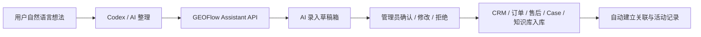

# Codex 业务录入助手 API 白皮书

更新时间：2026-06-19  
状态：Phase 0 / Phase 1 已进入实现与验证阶段  
目标模块：GEOFlow API、轻量 CRM、知识库、Case DB、售后、订单、Agent 协作流程

## 0. 当前实施状态

截至 2026-06-19：

- Phase 0 已完成初步审计：现有 `/api/v1` 已具备 Bearer Token、scope、统一响应信封、Request-Id 和幂等写操作基础；缺口集中在 CRM 写入 API、Assistant 草稿箱、预检 / 确认 / 应用流程和专用审计。
- Phase 1 已新增只读上下文搜索的实现方向：`GET /api/v1/assistant/context/search`，scope 为 `assistant:read`。
- Phase 1 的接口只允许读取候选上下文，不创建、不更新、不删除任何业务数据。
- 当前搜索范围覆盖：客户、联系人、询盘、商机、单据、订单、售后、Entity、知识库、Case。
- 搜索支持 `collection_id` 限定，避免跨业务容器误匹配。
- 后续 Phase 2 才允许创建 `ai_intake_drafts` 草稿箱；不要跳过草稿箱直接写 CRM 业务表。

## 1. 产品目标

让用户可以用自然语言描述客户、询盘、订单、售后、案例、知识库补充等业务思考，由 Codex / AI 先整理成结构化草稿，再通过 GEOFlow API 写入“待确认草稿箱”。管理员确认后，系统再真正创建或更新 CRM、知识库、Case、售后和关联关系。

核心价值不是让 Codex 直接替代后台表单，而是把“自然语言思考”变成“可审核、可追踪、可回滚的数据操作建议”。

推荐命名：

- AI 业务录入助手
- Codex Intake Assistant
- AI Intake Drafts

## 2. PM 结论

这个方向可行，而且和目前 GEOFlow 的演进方向高度匹配。

但不建议让 Codex 直接写数据库，也不建议完全跳过人工确认。正确路线是：



原因：

- CRM 和售后数据是业务事实，不能只依赖聊天上下文保存。
- Codex 对话历史可以帮助理解系统设计，但不能作为长期可靠业务数据库。
- 客户、订单、售后、Case、知识库之间有很多关系，AI 可能误判。
- 草稿箱可以降低录入成本，同时保留人工审核和回滚能力。

## 3. 当前 API 能力评估

当前 GEOFlow 已有 `/api/v1` API 基础能力，适合作为新能力的底座，但不足以直接支撑“Codex 业务录入助手”。

### 3.1 已具备能力

现有 `routes/api.php` 主要包含：

| 能力 | 当前接口 | 说明 |
| --- | --- | --- |
| API 登录 | `POST /api/v1/auth/login` | 管理员用户名密码换取 Bearer Token |
| Catalog | `GET /api/v1/catalog` | 返回任务创建所需模型、提示词、素材库等元数据 |
| 任务 | `/api/v1/tasks...` | 任务 CRUD、启动、停止、入队、任务执行记录 |
| Jobs | `GET /api/v1/jobs/{job}` | 查询执行记录 |
| 素材库 | `/api/v1/materials...` | 分类、作者、关键词库、标题库、图片库、知识库基础管理 |
| 文章 | `/api/v1/articles...` | 文章 CRUD、审核、发布、软删 |

现有 API 已有一些很好的基础：

- Bearer Token 鉴权。
- scope 权限控制。
- `X-Request-Id` 请求追踪。
- 写操作支持 `X-Idempotency-Key` 幂等键。
- 使用 Laravel Controller + Service 分层，便于扩展。

### 3.2 主要不足

当前 API 暂不够用，缺口集中在 CRM 和 AI 草稿层：

| 缺口 | 影响 |
| --- | --- |
| 没有 CRM 客户 API | Codex 无法安全查询、创建、更新客户 |
| 没有询盘 / 商机 / 单据 / 订单 / 售后 API | 无法完成完整销售链路录入 |
| 没有 Case DB API | 无法把售后或客户案例沉淀为 Case |
| 没有 Entity / Collection 专用搜索 API | 关联对象匹配会不稳定 |
| 没有 AI 录入草稿箱 | Codex 如果直接调用写接口，风险过高 |
| 没有“预检 / diff / apply”流程 | 无法在真正入库前确认影响范围 |
| API scope 不包含 CRM 和 assistant 专用权限 | 不适合给 Codex 使用全量 `*` 或 materials 权限 |
| API 写入审计尚未覆盖专门的 AI 操作语义 | 后续难以追踪 AI 做了什么 |

结论：

现有 API 可以复用认证、scope、幂等、响应格式和 Request-Id，但需要新增一层 Assistant API 和 CRM API。

## 4. 设计原则

### 4.1 不让 Codex 直接写最终业务表

Codex 不应直接创建客户、订单、售后或 Case。它应该先创建 `ai_intake_draft`。

真正写入业务表必须经过：

1. 系统校验。
2. 管理员确认。
3. 应用操作。
4. 审计日志。

### 4.2 业务事实以 GEOFlow 数据库为准

Codex 聊天记录只用于“理解”和“整理”，不能作为事实来源。

例如：

- 客户是否存在，以 `crm_customers` 为准。
- 订单是否存在，以 `crm_sales_orders` 为准。
- 售后是否已解决，以 `crm_after_sales_tickets` 为准。
- Case 是否可复用，以 `case_records` 为准。

### 4.3 所有写操作必须幂等

Codex 可能因为网络、上下文或工具重试重复调用 API，所以所有创建草稿和应用草稿的接口都必须支持 `X-Idempotency-Key`。

建议幂等键格式：

```text
codex-intake:{source}:{date}:{hash}
```

### 4.4 先读上下文，再生成草稿

推荐流程：

1. Codex 先调用搜索 API 查询相关客户、Entity、订单、售后、Case。
2. Codex 基于查询结果生成草稿。
3. GEOFlow 校验草稿里的关联是否真实存在。
4. 管理员确认后应用。

### 4.5 高风险动作必须人工确认

以下动作不能自动应用：

- 覆盖客户核心信息。
- 修改订单金额、付款状态、发货状态。
- 关闭售后工单。
- 应用知识库纠错。
- 删除或合并数据。
- 创建对外可见文章或发布内容。

## 5. 建议新增数据结构

### 5.1 `ai_intake_drafts`

用于保存一次自然语言输入解析后的总草稿。

建议字段：

| 字段 | 说明 |
| --- | --- |
| `id` | 主键 |
| `source` | `codex` / `admin_form` / `api` |
| `source_reference` | 可选，来源线程、文件、URL 或人工备注 |
| `collection_id` | 业务容器，可为空但建议尽量填写 |
| `raw_input` | 用户原始自然语言 |
| `normalized_summary` | AI 整理后的摘要 |
| `status` | `draft` / `needs_review` / `approved` / `applied` / `rejected` / `failed` |
| `confidence` | 总体置信度 |
| `detected_language` | 输入语言 |
| `created_by_admin_id` | 创建人 |
| `reviewed_by_admin_id` | 审核人 |
| `applied_at` | 应用时间 |
| `rejected_reason` | 拒绝原因 |
| `metadata_json` | 模型、提示词版本、Request-Id 等 |
| `created_at` / `updated_at` | 时间 |

### 5.2 `ai_intake_actions`

每一个草稿可以包含多个待执行动作。

建议字段：

| 字段 | 说明 |
| --- | --- |
| `id` | 主键 |
| `draft_id` | 关联草稿 |
| `action_type` | `create` / `update` / `link` / `note` / `todo` / `proposal` |
| `target_type` | `customer` / `inquiry` / `opportunity` / `quote` / `order` / `ticket` / `case` / `knowledge_base` / `entity` |
| `target_id` | 已存在对象 ID，新建时为空 |
| `payload_json` | 待写入字段 |
| `relation_json` | 建议建立的关联 |
| `diff_json` | 对已有对象的修改 diff |
| `confidence` | 单动作置信度 |
| `risk_level` | `low` / `medium` / `high` |
| `status` | `pending` / `approved` / `applied` / `rejected` / `failed` |
| `error_message` | 应用失败原因 |

### 5.3 `ai_intake_matches`

可选表，用于保存 AI 匹配到的候选对象。

例如用户说“西班牙客户的 SJ4060 问题”，系统可能匹配：

- 客户 A：置信度 0.82
- 客户 B：置信度 0.53
- Entity：SJ4060，置信度 0.96
- 售后工单：针头堵塞，置信度 0.77

保存候选匹配的好处是后台可以展示“AI 为什么建议这样关联”。

## 6. 建议新增 API

### 6.1 Assistant 上下文搜索 API

用于让 Codex 在整理前先查询现有业务数据。

```http
GET /api/v1/assistant/context/search?q=SJ4060 Spain nozzle clogging&collection_id=1
```

返回建议包含：

- customers
- contacts
- inquiries
- opportunities
- orders
- tickets
- entities
- knowledge_bases
- cases

建议 scope：

```text
assistant:read
crm:read
materials:read
```

### 6.2 创建 AI 录入草稿

```http
POST /api/v1/assistant/intake-drafts
```

请求示例：

```json
{
  "source": "codex",
  "collection_id": 1,
  "raw_input": "客户反馈 SJ4060 针头堵塞，可能和胶水粘度有关...",
  "normalized_summary": "西班牙客户反馈 SJ4060 点胶针头堵塞，需要创建售后跟进并沉淀 FAQ。",
  "actions": [
    {
      "action_type": "create",
      "target_type": "ticket",
      "payload": {
        "title": "SJ4060 needle clogging issue",
        "issue_type": "troubleshooting",
        "priority": "normal"
      },
      "relations": {
        "customer_id": 12,
        "entity_id": 8
      },
      "confidence": 0.84,
      "risk_level": "medium"
    },
    {
      "action_type": "proposal",
      "target_type": "knowledge_base",
      "payload": {
        "knowledge_type": "faq",
        "title": "How to troubleshoot SJ4060 needle clogging"
      },
      "confidence": 0.72,
      "risk_level": "medium"
    }
  ]
}
```

### 6.3 草稿预检

```http
POST /api/v1/assistant/intake-drafts/{draft}/validate
```

预检内容：

- 关联对象是否存在。
- Collection 是否一致。
- 是否可能重复创建客户、询盘、售后、Case。
- 必填字段是否缺失。
- 高风险动作是否需要人工确认。
- 是否存在与当前 CRM 销售链路冲突的操作。

### 6.4 应用草稿

```http
POST /api/v1/assistant/intake-drafts/{draft}/apply
```

必须满足：

- 草稿处于 `approved` 或管理员主动点击确认。
- 每个 action 独立事务或整组事务策略明确。
- 应用后写入 `admin_activity_logs`。
- 返回实际创建或更新的对象 ID。

### 6.5 拒绝草稿

```http
POST /api/v1/assistant/intake-drafts/{draft}/reject
```

必须保存拒绝原因，便于后续优化提示词和匹配规则。

## 7. CRM API 补齐范围

现有 API 不应一次性扩展成完整 ERP。建议先补“AI 业务录入助手需要的最小 CRM API”。

### 7.1 第一批必须补齐

| API | 目的 |
| --- | --- |
| `GET /api/v1/crm/customers` | 搜索客户 |
| `GET /api/v1/crm/customers/{id}` | 查看客户详情和关联链路 |
| `POST /api/v1/crm/customers` | 创建客户，主要由草稿 apply 调用 |
| `PATCH /api/v1/crm/customers/{id}` | 更新客户，需 diff 确认 |
| `GET /api/v1/crm/inquiries` | 搜索询盘 |
| `POST /api/v1/crm/inquiries` | 创建询盘 |
| `GET /api/v1/crm/opportunities` | 搜索商机 |
| `POST /api/v1/crm/opportunities` | 创建商机，必须可关联来源询盘 |
| `GET /api/v1/crm/orders` | 搜索订单 |
| `GET /api/v1/crm/tickets` | 搜索售后 |
| `POST /api/v1/crm/tickets` | 创建售后工单 |
| `POST /api/v1/crm/follow-ups` | 创建活动记录 |
| `POST /api/v1/crm/tasks` | 创建下一步待办 |

### 7.2 第二批再补齐

| API | 目的 |
| --- | --- |
| `POST /api/v1/crm/quotes` | 创建报价 / PI 草稿 |
| `POST /api/v1/crm/orders` | 从确认单据创建订单 |
| `PATCH /api/v1/crm/tickets/{id}` | 更新售后状态和解决方案 |
| `POST /api/v1/cases` | 创建 Case |
| `POST /api/v1/knowledge/proposals` | 创建知识库补充 proposal |

## 8. 后台 UI 建议

### 8.1 新增菜单

建议放在 CRM 或顶部工具区：

```text
AI 录入草稿箱
```

### 8.2 草稿列表

列表字段：

- 状态
- 来源
- Collection
- 摘要
- 动作数量
- 高风险动作数量
- 置信度
- 创建时间
- 操作：查看 / 应用 / 拒绝

### 8.3 草稿详情

草稿详情应以“业务影响”为核心展示，而不是直接展示 JSON。

推荐布局：

1. 原始输入。
2. AI 摘要。
3. 识别到的客户 / Entity / 订单 / 售后 / Case。
4. 将要执行的动作卡片。
5. 每个动作显示：
   - 创建什么。
   - 更新什么字段。
   - 建立什么关联。
   - 有什么不确定。
   - 风险等级。
6. 底部操作：
   - 应用全部低风险动作。
   - 单独应用某个动作。
   - 编辑后应用。
   - 拒绝。

### 8.4 冲突提醒

需要特别提醒：

- 客户疑似重复。
- 售后疑似已存在。
- 订单不属于该客户。
- Entity 不属于当前 Collection。
- Case 与知识库内容重复。
- AI 无法确认客户或产品型号。

## 9. Codex 使用方式建议

### 9.1 Codex 不保存 API Token

API Token 不应写进聊天记录或文档。建议：

- Token 放在本地 `.env` 或系统钥匙串。
- Codex 只调用本机脚本或受控工具。
- Token 使用最小 scope，短过期时间，可随时撤销。

### 9.2 Codex 工作流

用户输入：

```text
今天西班牙客户反馈 SJ4060 针头堵塞，可能和胶水粘度有关。
帮我记录售后，并整理成后续 FAQ 的草稿。
```

Codex 应该做：

1. 调用 context search 查询客户、SJ4060、已有售后、已有 FAQ。
2. 如果匹配不确定，向用户提出一个业务问题。
3. 生成 intake draft。
4. 告诉用户去 GEOFlow 后台草稿箱确认。

Codex 不应该做：

- 在未确认客户时直接创建客户。
- 在未确认订单时直接关联订单。
- 直接覆盖知识库正文。
- 直接关闭售后工单。

## 10. 推荐 Prompt 契约

给 Codex / AI 的解析输出建议固定为 JSON，避免自由文本难以稳定入库。

```json
{
  "intent": "crm_intake",
  "language": "zh_CN",
  "summary": "",
  "collection_hint": "",
  "entities_mentioned": [],
  "customers_mentioned": [],
  "actions": [
    {
      "action_type": "create|update|link|note|todo|proposal",
      "target_type": "customer|inquiry|opportunity|quote|order|ticket|case|knowledge_base|entity",
      "target_match": {
        "id": null,
        "confidence": 0,
        "reason": ""
      },
      "payload": {},
      "relations": {},
      "missing_fields": [],
      "risk_level": "low|medium|high",
      "confidence": 0,
      "review_notes": ""
    }
  ],
  "questions_for_user": []
}
```

## 11. 关联策略

### 11.1 Collection 优先

只要能判断业务线，就先确定 Collection。

所有后续匹配都优先限制在同一 Collection 内：

- 客户
- Entity
- 询盘
- 商机
- 单据
- 订单
- 售后
- Case
- 知识库

### 11.2 Entity 是业务索引节点

如果用户提到产品型号、产品线、行业应用或工艺对象，应优先匹配 Entity。

示例：

- SJ4060
- DJ771
- PU Resin
- Battery Manufacturing
- Wafer Processing

### 11.3 Case 和知识库分工

售后和真实客户故事沉淀为 Case。  
FAQ、手册、参数、排障指南沉淀为 Knowledge Base。  
不要把 Case 直接塞进 Knowledge Base，避免重复。

### 11.4 活动记录和待办分工

- 活动记录：已经发生的沟通事实。
- 待办：下一步需要做的动作。

AI 录入时可以同时建议二者，但必须分开保存。

## 12. 安全与权限设计

建议新增 scope：

```text
assistant:read
assistant:write
assistant:apply
crm:read
crm:write
crm:apply_high_risk
cases:read
cases:write
knowledge:read
knowledge:proposal
```

推荐给 Codex 的 Token：

```text
assistant:read
assistant:write
crm:read
cases:read
knowledge:read
```

默认不授予：

```text
assistant:apply
crm:write
crm:apply_high_risk
articles:publish
```

也就是说，Codex 默认只能创建草稿，不能直接应用草稿。

## 13. 审计与回滚

每次草稿创建、修改、审批、应用、拒绝都应写入审计。

建议记录：

- request_id
- token_id
- admin_id
- draft_id
- action_id
- action_type
- target_type
- target_id
- before_json
- after_json

对于高风险更新，需要保存修改前快照，至少支持人工恢复。

## 14. 分阶段开发计划

### Phase 0：API 能力审计与契约冻结

目标：确认当前 API、CRM 数据模型和后台流程边界。

要做：

- 梳理现有 `/api/v1` 响应格式。
- 梳理 CRM 模型字段和关联。
- 明确哪些字段可由 AI 建议，哪些必须人工填写。
- 冻结 intake draft JSON 契约。

验收：

- 输出 API 缺口清单。
- 输出 draft schema。
- 不修改现有业务流程。

### Phase 1：只读上下文搜索 API

目标：让 Codex 可以安全查询上下文，但不能写入业务数据。

要做：

- 新增 `assistant:read` scope。
- 新增 `/api/v1/assistant/context/search`。
- 返回客户、Entity、订单、售后、Case、知识库候选。
- 支持 collection 过滤。

验收：

- Codex 能根据一句话找到候选客户和 Entity。
- 不产生任何业务写入。

### Phase 2：AI 录入草稿箱

目标：Codex 可以创建草稿，但不直接入库。

要做：

- 新增 `ai_intake_drafts`。
- 新增 `ai_intake_actions`。
- 新增后台草稿列表和详情页。
- 新增草稿 validate 接口。

验收：

- 一段自然语言可以变成多个待确认动作。
- 后台可以看到每个动作的风险、置信度和关联对象。

### Phase 3：低风险 CRM 应用

目标：管理员确认后，系统可以创建低风险 CRM 记录。

第一批支持：

- 创建客户。
- 创建询盘。
- 创建活动记录。
- 创建待办。
- 创建售后工单草稿。
- 建立 Entity / Collection 关联。

暂不支持：

- 自动修改订单金额。
- 自动关闭售后。
- 自动发布内容。
- 自动覆盖知识库正文。

验收：

- 应用草稿后能看到真实 CRM 记录。
- 所有动作写入审计。
- 应用失败不会产生半脏数据。

### Phase 4：知识库 / Case Proposal

目标：把售后、询盘和客户沟通沉淀为知识库或 Case 候选。

要做：

- 支持创建 Case 草稿。
- 支持创建知识库补充 proposal。
- 复用现有知识库纠错和治理 proposal 思路。
- 管理员确认后再入库。

验收：

- 售后问题可以生成 FAQ 草稿。
- 客户应用故事可以生成 Case 草稿。
- 不直接覆盖现有知识库内容。

### Phase 5：Codex 本地调用适配

目标：让 Codex 能通过稳定脚本调用 GEOFlow API。

要做：

- 新增本地脚本，例如 `scripts/codex-intake.mjs`。
- 从本地环境变量读取 API Token。
- 封装 context search、create draft、show draft。
- 输出可读摘要。

验收：

- Codex 可以用一条命令创建草稿。
- Token 不出现在文档和聊天记录里。

### Phase 6：治理与质量增强

目标：避免 AI 草稿箱变成新的混乱来源。

要做：

- 重复客户检测。
- 重复售后检测。
- Case / 知识库重复检测。
- Collection 缺失检测。
- 低置信度草稿提醒。
- 长期未处理草稿清理。

验收：

- 草稿列表能按风险和置信度筛选。
- 系统能提示“这可能是重复记录”。

## 15. 测试策略

至少需要：

- API token scope 测试。
- context search 测试。
- draft create / validate / reject / apply 测试。
- 幂等键重复提交测试。
- Collection 不一致拦截测试。
- 重复客户检测测试。
- 售后工单创建测试。
- Case / Knowledge proposal 测试。
- 审计日志测试。

UI 需要：

- 草稿列表截图检查。
- 草稿详情长内容截图检查。
- 低置信度 / 高风险 / 冲突状态截图检查。

## 16. 风险与边界

| 风险 | 处理方式 |
| --- | --- |
| Codex 误判客户 | 只创建草稿，人工确认 |
| 重复创建客户或工单 | context search + duplicate check |
| API Token 泄露 | 短 TTL、最小 scope、本地环境变量 |
| AI 覆盖业务事实 | 禁止直接覆盖核心字段 |
| 聊天历史不完整 | 业务事实以数据库为准 |
| 草稿箱堆积 | 增加状态筛选和定期清理 |
| 数据关系复杂 | 优先 Collection + Entity 限定范围 |

## 17. MVP 建议

最小可行版本不要追求全自动。

建议 MVP 只做：

1. Assistant context search。
2. Intake draft 数据表。
3. 创建草稿 API。
4. 草稿箱后台页面。
5. 人工确认后创建：
   - 活动记录。
   - 待办。
   - 售后工单。
   - 知识库 / Case proposal。

暂时不要做：

- 自动创建订单。
- 自动生成报价。
- 自动修改订单状态。
- 自动关闭售后。
- 自动发布文章。

## 18. 推荐下一步

如果后续要进入开发，建议从 Phase 0 和 Phase 1 开始。

第一条开发提示词可以是：

```text
基于 agent-docs/CODEX_BUSINESS_INTAKE_API_WHITEPAPER.md，先执行 Phase 0 和 Phase 1。
目标是审计现有 API 和 CRM 数据结构，新增只读 Assistant Context Search API。
不要新增最终写入业务表的能力。
完成后更新白皮书中的实现状态，并提供 API 示例、scope 说明和测试结果。
```
